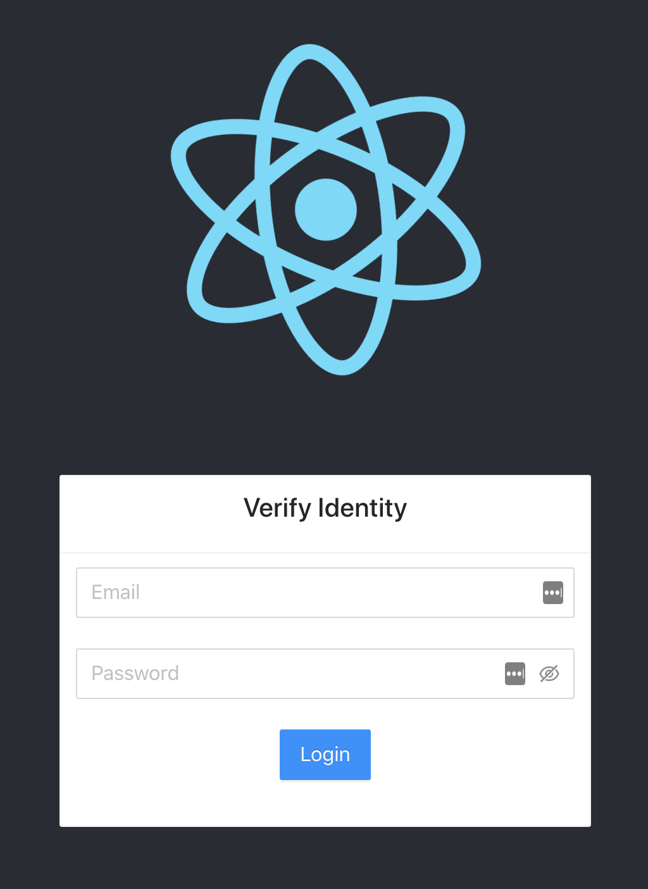
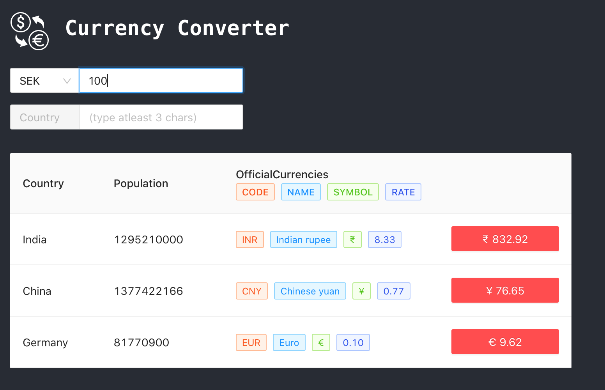

# Currency Converter App

I have created the application as it was explained in the email. It was really fun and I learnt some new things too.
I tried to create the best possible architecture and kept the project modular. I also used the best coding practices upto full extent.

| Login Page                                                       | Currency conversion area                                               |
| ---------------------------------------------------------------- | ---------------------------------------------------------------------- |
|  |  |

## Tech Stack

1. **NodeJS** - JavaScript engine for running back end JS code
1. **ExpressJS** - Web Framework used to create API
1. **React** - JavaScript library for building UI
1. **Heroku** - For hosting the application

## Good design decisions

-   **Token bucket** algorithm is used to implement the rate limitting, this helps us to maintain a window of a time duration without taking extra space. Also rate of API requests can be dynamic (can be different for different paid plans?)

-   **Debouncing** is used in client app to maintain the UX and reduce the number of calls to the API server.

-   **Graceful Shutdown** of the API server, ensures that there is **no interruption** in request processing of the APIs in case of restart/redeploy.

-   External services (Fixer, restcountries) are used such that changing the service provider is really easy and **abstracted outside** of the main logic.

-   User can decide any base currency from which he/she can convert the values.

-   Currency data is cached, this stops us from hitting the external service repeatedly and helps us optimize our usage.

-   Request schema validation is done using Joi.

## Possible improvements

-   I have used application memory as the cache for rate limitting checks (due to ease of implementation), but for a distributed system where API is deployed on multiple instances, redis or memcache should be used.

-   Typescript could have been used as the language of choice because of a lot of advantages, but because this was a small project I decided to go with JS which also helped in fast development. But I recommend using Typescript for big projects.

## Design choices mmade due to time constraint (can be made better)

-   Rather than static auth, better authentication flow can be used, I prefer using OAuth. Also managing the access token can be improved, can include refresh token flow and generation of access token should be taken care with an API key.

-   Currency rates can be updated by polling in some defined interval by the client application.

-   There is some issue with ant-design which I wasn't able to solve. During build process ant-design wasn't able to prune the components not used in the client app, I dug and found that there is some issue in tree shaking during build.

-   There can be separate api for searching a country and another api to fetch the data in detail. This will help us to use an npm package of countries list (which can result in fast search) rather than calling the external service to search for a country name.

## Environment variables

-   `.env` file is used to set environment variables. `env` file is passed when starting the docker container using the flag `--env-file`.
-   `.env` example is given in the [.env.example](./.env.example) file

## How to start the application on your system?

Setting up the project in your local system is really easy and can be done in the following steps:

1. Clone the repository.

2. Make sure you have docker installed.

3. Run the following command in the root of the application directory.

    ```bash
    docker build --tag cc-server .
    ```

    This will build a docker image of the application. You'll also see the tests running.
    Additionally you can run `npm test --prefix=backend` on the root directory.

4. Now to start the app using the above built docker image run the command:

    ```bash
    docker run -p 80:8081 --env-file ./backend/.envs cc-server
    ```

    This command will start the image in a docker container.

    `-p` option is used to publish the container's port to the host, our application runs on port 8081 and we are forwarding it to our host's 8080 port

    `--env-file` option is used to provide a env file (as shown in the [.env.example](./.env.example) file) to populate the env variables inside the container.

5. Open [http://localhost](http://localhost) on your browser.

The application is also deployed on heroku. [https://cc-saurabh.herokuapp.com/](https://cc-saurabh.herokuapp.com/)

## API request format

To fetch the data using the API you need to have the access token, which you get after logging in. Access token is added in the authorization header as a bearer token, which is used by the backend server to authenticate the request. cURL request is attached below:

```bash
curl --location --request \
GET 'http://cc-saurabh.herokuapp.com/v1/country/search?query=India' \
--header 'Authorization: Bearer <ACCESS_TOKEN>'
```

## Production environment setup

-   The API is deployed on Heroku. It doesn't uses Heroku's normal application builds, rather I have used Heroku Container Registry where I have deployed my custom container.

-   Docker is used for containerization. I have used custom Dockerfile which uses node to run the application.

-   For high scalability container images can be deployed directly with Kubernetes.

## Development tools

-   **VS-Code** - All the development was done using Visual Studio Code
-   **git** - git is used for version control
-   **eslint** - It helps in keeping the code semantic and unifies the coding style all over the project.
-   **prettier** - Code formatter, keeps the code format unique across the codebase.
